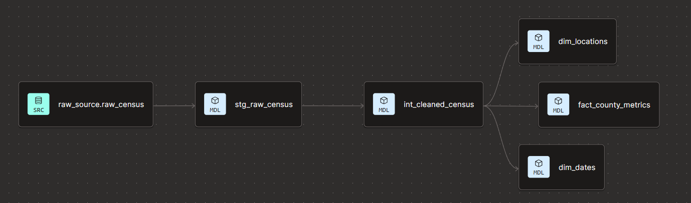

# Cloud-Native US Census ELT Pipeline
## Executive Summary
This project is an automated, cloud-native ELT (Extract, Load, Transform) pipeline designed to ingest, process, 
and visualize demographic and economic data from the US Census Bureau API. The primary objective is to transform raw governmental 
JSON payloads into an enterprise-grade dimensional model that fuels a high-resolution Amazon QuickSight dashboard.
The resulting business intelligence suite analyzes the "Opportunity Gap," providing an executive-level comparison of higher 
education attainment versus regional poverty lines across the United States.

## Architecture & Tech Stack
This project leverages a modern data stack architecture to ensure scalability, modularity, and data integrity:
 - **Extraction & Orchestration:** Python running on **AWS Lambda**, extracted JSON data from the US Census Bureau API.
 - **Data Lake (Landing Zone):** **AWS S3** for secure, scalable storage of raw JSON extracts.
 - **Data Warehouse:** **Snowflake**, utilizing automated ingestion (**Snowpipe**) to move data from **S3** into raw staging tables.
 - **Transformation & Modeling:** **dbt** (Data Build Tool) to execute SQL-based transformations, enforce testing, and build a clean Star Schema.
 - **Business Intelligence:** **AWS QuickSight** for interactive, executive-facing dashboards and geospatial analytics.

## Data Transformation & Dimensional Modeling
Once the raw data lands in Snowflake, dbt is utilized to clean, normalize, and model the data into a production-ready Star Schema.

Key Modeling Highlights:
- **Staging Layer:** Cleans raw API column names, standardizes data types, and handles null values. 
- **Core Layer (Dimensions & Facts):** Splits the data into logical entities (e.g., dim_locations for State/County mappings, fact_economic_metrics for income and poverty measurements). 
- **Aggregation Logic:** Ensures percentage-based metrics (like POVERTY_RATE and BACHELORS_DEGREE_RATE) are pre-calculated accurately to prevent erroneous summation at the BI layer.

## Dashboard & Visual Analytics
The visualization layer was built in Amazon QuickSight to provide actionable insights into socioeconomic trends without overwhelming the end-user with raw data points.
Dashboard Features:

- **Executive KPI Summaries:** High-level metrics formatting median household income, median home values, and total population counts with clean currency and numeric formatting.
- **State-Level Education Attainment vs. Poverty Rate:** A dual-metric clustered bar chart that cleanly visualizes the contrast between a state's higher education rate and its baseline poverty rate, instantly highlighting regional opportunity gaps.
- **Geographic Filtering:** Exclusion of outlier territories to establish a clean mainland US benchmark.
- **Granular Socioeconomic Reference Table:** A detailed, searchable matrix allowing stakeholders to verify the exact calculated averages for local counties.

